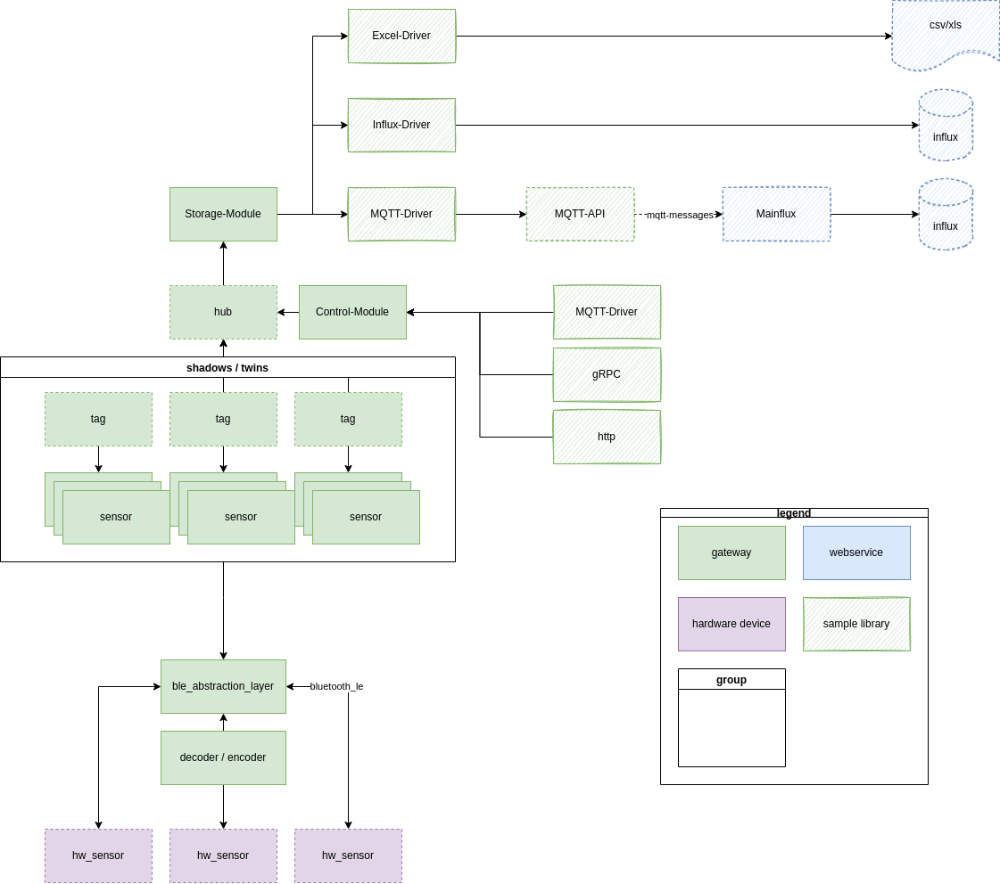

# Introduction
## What this project is about
This project is working with bluetooth low energy devices that implement different sensors and propably even actors. It aims to make these devices available for different Internet of Things use cases. This project is open to support future devices and their sensors. As a sample device you might want to use a Ruuvi-tag, which is an open source hardware platform or other nordic nrf52-based devices, as they all use the same bluetooth stack.
It is meant to run on a raspberry pi newer than 3b with integrated bluetooth 4.0 or similar linux-based platforms. It is also able to run on x86/amd64 hardware.

## Structure of the project
The software is split in different microservices and heavily depends on a message-broking system of any kind. This version is using MQTT but you can use any pubsub compatible broker (e.g. nats, AMQP, Kafka, etc.). All components are implemented with their own datamodels to make the broker protocols interchangeable. The main datamodel is defined by the python gateway library.
The gateway's repository is structured in different directories for the different microservices.

## Microservices
The gateway-software consists of three microservices:  
- python bluetooth low energy implementation  
- go connector to a mongo db  
- go command and control commandline interface  

The microservices connect to each other using the MQTT protocol. RabbitMQ is used as a MQTT-broker.

  
  
The block components of this diagram should be interpreted as functional blocks, not as the implementation itself. The functional blocks are either implemented as python classes or as a whole module.   

## Python ble-gateway implementation
### Classes
As a brief introduction to the python library it makes sense to have a view on this class diagram of the library:

``` mermaid
classDiagram
  Sensor <|-- HumiditySensor
  Sensor "n" <-- "1" Tag:has
  Measurement "n" <-- "1" Sensor:has
  HumidityMeasurement "n" <-- "1" HumiditySensor:has
  BLEConn "1" <-- "1" Hub:uses

  link Hub "/bchwtz-gateway/hub_ref/#gateway.hub.hub.Hub" "Hub"
  link Tag "/bchwtz-gateway/tag_ref/#gateway.tag.tag.Tag" "Tag"
  link Sensor "/bchwtz-gateway/sensor_ref/#gateway.sensor.sensor.Sensor" "Sensor"
  link HumiditySensor "/bchwtz-gateway/sensor_ref/#gateway.sensor.humidity.HumiditySensor" "Sensor"
  link Measurement "/bchwtz-gateway/sensor_ref/#gateway.sensor.measurement.Measurement" "Measurement"
  link HumidityMeasurement "/bchwtz-gateway/sensor_ref/#gateway.sensor.humidity.HumiditySensor.HumidityMeasurement" "HumidityMeasurement"
  link BLEConn "/bchwtz-gateway/ble_conn_ref/#gateway.drivers.bluetooth.ble_conn.ble_conn.BLEConn" "BLEConn"


  Tag "n" <-- "1" Hub:has
  class Sensor {
    +String name
    +[Measurement] measurements
  }

  class Tag{
    +String address
    +String name
  }
  class Hub{
    +String sensors
    +BLEConn ble_conn
  }
  class Measurement{
    +any measurement
    +[any] measurements
  }
  class HumiditySensor{
    +[HumidityMeasurement] measurements
  }
  class HumidityMeasurement{
    +float humidity
  }
  class BLEConn{
    +logging.logger loggerTo gather data from the sensortags, you will need a device running on linux with a bluetooth 4.0 compatible chipset on it. This software is used as a bluetooth low energy gateway (ble-gateway) that connects to your tags and a cloud solution to store the data of the tags and allows to send control events to them.


    scan_tags(manufacturer_id: int = 0, timeout: float = 20.0)
    listen_advertisements(timeout: float = 5.0, cb: Callable[[BLEDevice, dict], None] = None)
  }
```
In the diagram you can see the actual links and references of the different classes inside the library. If you need the implementation reference for a single class in this diagram, just click on its box and you will be forwarded to the correct page.

### How scanning for ble-advertisements works
This is how the gateway listens for advertisements and sets up new tags:

``` mermaid
sequenceDiagram
  participant Gateway
  participant Hub
  participant Tag
  participant BLEConn
  participant Encoder
  participant Decoder
  Gateway->>Hub: __init__()
  activate Hub

  loop listen_advertisements
    Gateway->>Hub: listen_advertisements(timeout=20)
    activate Hub
    Hub->>Gateway: return None
    Hub->>BLEConn: listen_advertisements(cb)
    deactivate Hub
  end
  Note right of Hub: startup procedure
  BLEConn-->>Hub: listen_advertisement_cb(msg)
  activate Hub
  Hub-->>Hub: check if this Tag already existed - if yes, add new data to the tag, if not add a new tag
  Hub->>Tag: __devices_to_tags()
  activate Tag
  Tag->>Hub: adds the Tag to taglist of hub
  Hub->>Tag: get_config()
  deactivate Hub
  Tag->>Encoder: encode message as bytearr
  activate Encoder
  Encoder->>Tag: return encoded bytearr
  deactivate Encoder
  Tag->>BLEConn: run_single_ble_command(cmd as bytearr)
  activate BLEConn
  BLEConn->>Tag: None on success
  BLEConn-->>Tag: cb on success
  deactivate BLEConn
  Tag->>Decoder: decode cb
  activate Decoder
  Decoder->>Tag: message as dict or primitive
  deactivate Decoder
  Tag-->>Tag: update values
  deactivate Tag
```