# Practical Considerations

## Sensor settings
This chapter is intended to give an overview about the three main sensor settings , give some theoretical insight and show the impact different settings can have on the tracking of activities.  
It is looked into the amplitudes and frequencies of acceleration components during walking, jogging, sprinting and doing squats at different sampling frequencies by recording in 100 Hz and then performing resampling and Fourier analysis. The goal here is to look at various sampling frequencies and find the limits in order to make informed choices for our own use case. The amplitudes are helpful in determining the needed measrurement range. At the end there are also some guidelines for choosing settings for different scenarios on the ruuviTag. 
Due to problems with the ruuviTag firmware that could only be resolved late in the process, which lead to further problems of lags, gateway crashes etc., it was decided to use an iPhone app instead. This should make no difference as the findings are based on frequency and amplitude values alone and give some insight into the reconstruction process of signals.

### Jupyter Notebook
The findings in this post are based on the jupyter notebook _analyse_accel.ipynb_ (can be found in the _demos_ folder of the repository).  
The notebook takes samples generated via the iPhone app "Physics Toolbox", resamples them and creates various plots of the timeseries, sections of activity. Additionally it creates distributions of sampled amplitudes and frequencies in order to allow for practical sensor setting considerations.  
The _Physics Toolbox_ app samples at 100 Hz and uses $\frac{m}{s^2}$ as unit, while the LIS2DH12 sensor in the ruuviTag returns results in _g_, with $g=9.81 \frac{m}{s^2}$. These are recalculated in _g_ for better applicability to our case.

### Measurement range/scale
The measurement range (scale) sets the maximum detectable acceleration for each axis, meaning that any values above the limit will get measured as maximum value. According to the [sensor datasheet](https://www.st.com/resource/en/datasheet/lis2dh12.pdf)(p.10) the possible values are 2g, 4g, 8g and 16g, where _g_ stands for G-forces, meaning an acceleration of 9.81 m/s².  
The sensitivity (resolution) setting of the sensor impacts the amount of available quantization levels for the measurement. The sensor offers three different modes, _low-power_ (8-bit data output), _normal_ (10-bit data output) and _high resolution_ (12-bit data output), where 1 bit is used for the sign (direction) of the acceleration while the other bits are used for quantization. In low-power mode this would lead to $2^{8-1} = 128$ different levels, while the actual range of each of these steps can be calculated by the following formula:  

\[S=\frac{M}{2^{bits - 1}}\]

where _M_ is the measurement range (scale). From this formula it becomes clear that due to the limited amount of quantization levels there is a tradeoff between maximum acceleration and highest resolution, as a smaller measurement range will lead to increased sensitivity, meaning that more subtle changes in acceleration can be detected, at the disadvantage of hitting the acceleration limit earlier and losing any specific information for affected samples. A bigger scale on the other hand will have a higher maximum acceleration limit, but will be unable to pick up on smaller changes in acceleration in comparison to the former approach. All sensitivities for the different settings can be found in the [sensor datasheet](https://www.st.com/resource/en/datasheet/lis2dh12.pdf)(p.10), and even the worst possible resolution is still 192mg/digit (8-bit, 16g). Given the activities mentioned above the vast majority of sampled data has values smaller than 2g (see below), but for sprinting some crosses the threshold of 4g and even come close to 8g. Using a range of 4g at 8-bit would result in a resolution of 32mg/digit.  
It is important to note that changing the sensor output resolution impacts the bandwith $f_{max}$ (highest detectable frequency component without aliasing, more information below). The bandwith is behaving as expected (half of sampling rate) for 8-bit and 10-bit while it does go down to 1/9 of the sampling rate for 12-bit resolution, rendering this setting pointless for our case.[[sensor datasheet]](https://www.st.com/resource/en/datasheet/lis2dh12.pdf)(p.16)  

#### Results
In the pictures below can be seen that the three different activities result in similar amplitude distributions, but at different scales. For the accelerometer, where sprinting has the highest amplitudes (meaning highest acceleration), sometimes exceeding 6g, doing squats leads only to comparably low accelerations and a narrow spectrum.

Amplitude distribution walking | Amplitude distribution jogging | Amplitude distribution sprinting
--- | --- | ---
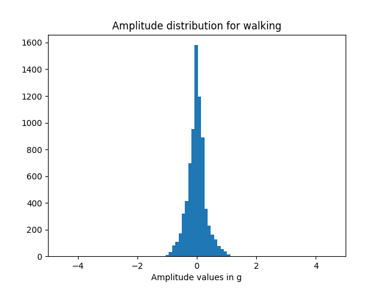 | 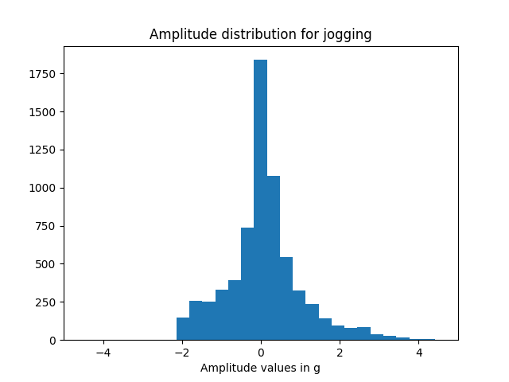 | 

Again the same distributions, but this time more zoomed in.

Amplitude distribution walking | Amplitude distribution jogging | Amplitude distribution sprinting
--- | --- | ---
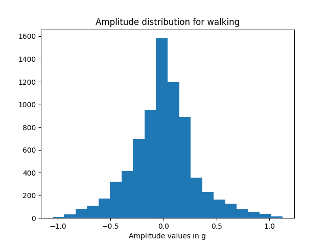 | 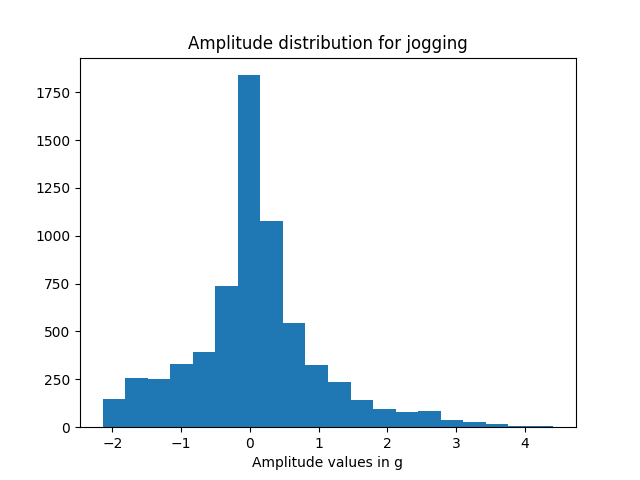 | 

The CFD look also quite similar but differ significantly when focussing on the range for the measurements. During sprinting peak values almost exceed 8g, while for jogging the highest values are around 4g, for walking around 1g.

Amplitude CFD walking | Amplitude CFD jogging | Amplitude CFD sprinting
--- | --- | ---
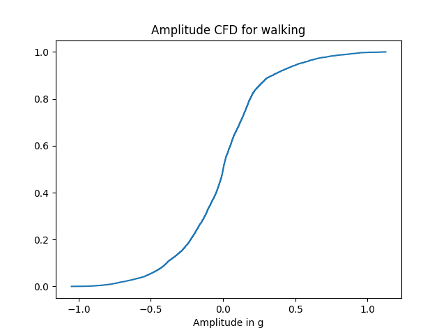 |  | 

Here the distribution and CFD of the amplitudes for doing squats are shown, it can be seen that the values are significantly smaller when compared to all running related activities (even walking), maxing out at around 0.5g.

Amplitude distribution squats | Amplitude CFD squats
--- | --- 
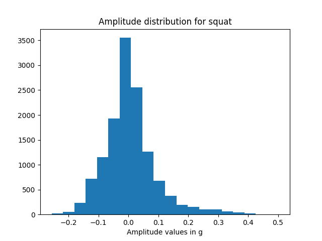 | 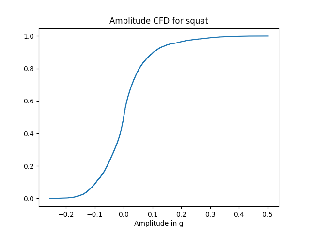

These findings show that there are significant differences in the scale of accelerations when looking at different activities. The sensor settings for measurement range should therefore vary depending on the activity in order to find the best suitable tradeoff between range and sensitivity.  
The following table gives an overview about the maximum measured acceleration during the different activities:  

Desc | Walking | Jogging | Sprinting | Squat
------ | ------ | ------ | ------ | ------
Max acceleration (in g) | 1.126  | 4.416 | 7.342 | 0.501

### Sample Rate 
#### Basics
The RuuviTag implementation allows for sampling rates of 1 Hz, 10 Hz, 25 Hz, 50 Hz, 100 Hz, 200 Hz and 400 Hz. In order to cleanly sample a complete basic movement cycle during an activity (e.g. two steps when walking), the frequency (or 1/duration of movement in s) of this basic movement is not allowed to exceed half of the sampling rate $f_{sample}$, according to the Nyquist-Theorem:[[Introduction]](https://home.strw.leidenuniv.nl/~por/AOT2019/docs/AOT_2019_Ex13_NyquistTheorem.pdf)  

\[f_{sample} \geq 2*f_{max}\] 

Every frequency above $\frac{f_{sample}}{2}$ will be reconstructed at lower frequencies (_aliasing_), leading to additional noise in these lower frequency domains as well as losing all the information components about the activity at these frequencies.  
While sampling activities like walking, jogging and squats it could be seen that some of the largest frequency components for these might be close or above 5 Hz (see below).

#### Experimentation Results
In this section the findings of varying experiments regarding different sampling rates and their impacts on timeseriees reconstruction are presented.
##### Results Walking
Sampling freq: 1 Hz | Sampling freq: 2 Hz | Sampling freq: 5 Hz
--- | --- | ---
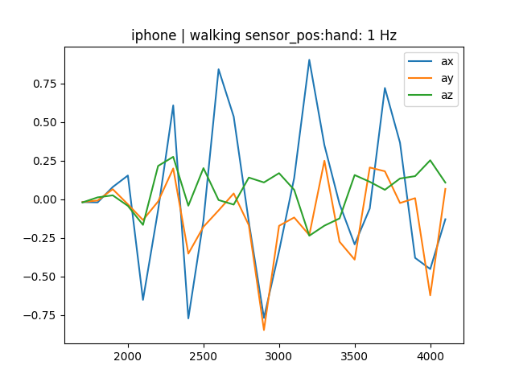 | 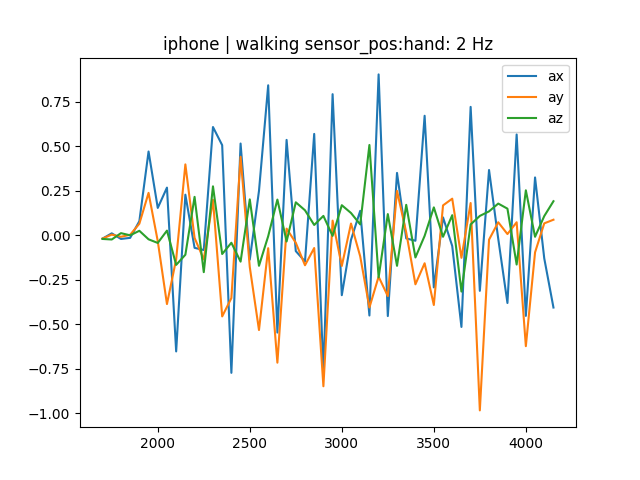 | 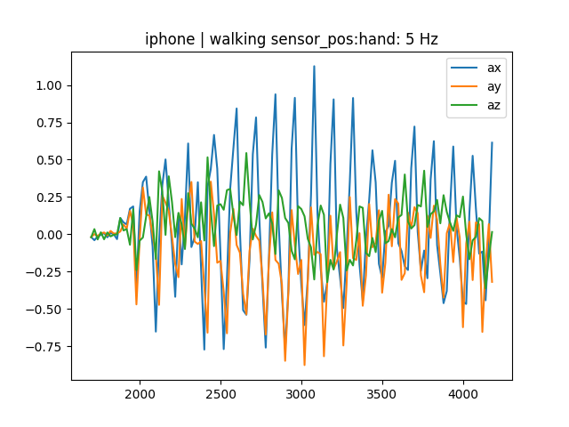

Sampling freq: 10 Hz | Sampling freq: 100 Hz
--- | ---
 | 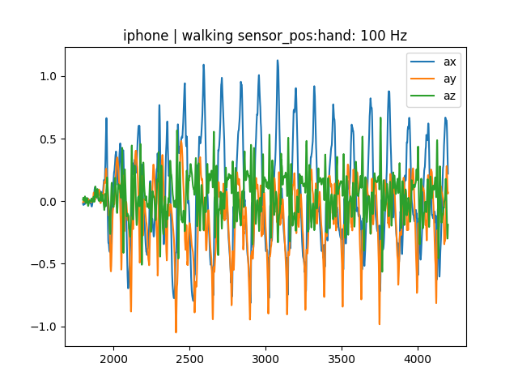

The lower sampling frequencies of 1 and 2 Hz do not seem enough to capture all necessary information when measuring the activity of walking, which can be seen in the different reconstruction when compared to 5 Hz. 5 Hz, 10 Hz and 20 Hz on the other hand are looking quite similar.  

Spectrum narrow view | Spectrum wider view
--- | ---
 | 

Looking at the frequency spectrum it can be seen that there are distinct peaks at around 0.8 Hz, 1.8 Hz and even at 4.8 Hz which would result in aliasing when sampling at 5 Hz. Even a relatively slow activity like walking benefits from a sampling rate of at least 10 Hz.  
The CFD suggests that the frequencies up to 10 Hz make up between 80-90 % of the energy of the spectrum.
  
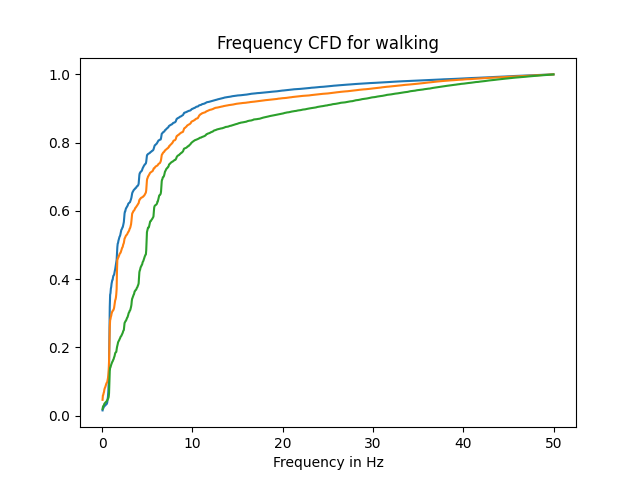 

##### Results Jogging
Sampling freq: 1 Hz | Sampling freq: 5 Hz | Sampling freq: 10 Hz
--- | --- | ---
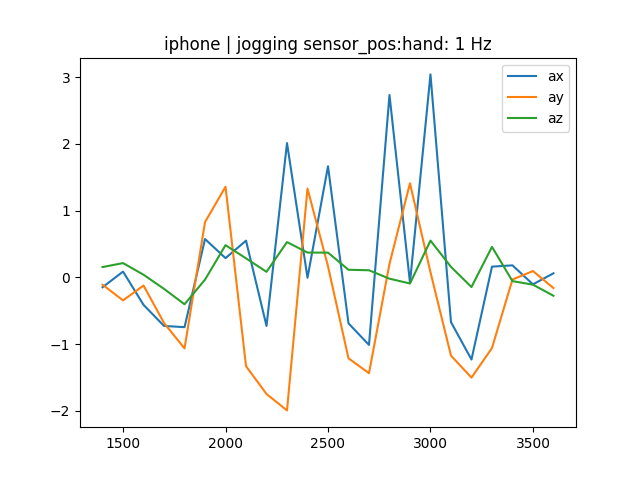 |  | 

Sampling freq: 10 Hz | Sampling freq: 100 Hz
--- | ---
 | 

Looking at the images above it becomes clear that a sampling rate of 1 Hz is not sufficient to reconstruct the signal, and even 5 Hz looks significantly different when compared to 10 Hz and might not have captured all major peaks. The difference between 10 Hz and 100 Hz on the other hand is rather small.  

Spectrum narrow view | Spectrum wider view
--- | ---
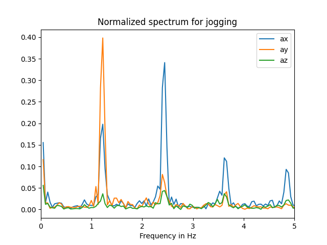 | 

In the frequency spectrum it can be seen that there are quite distinct peaks at certain frequencies, where one of those is around 5 Hz, meaning that even a sampling frequency of 10 Hz might be too low to capture all the information given variation in jogging speed etc. The CFD shows that around 80% of the energy of the spectrum is located up to a frequency of 10 Hz.
  
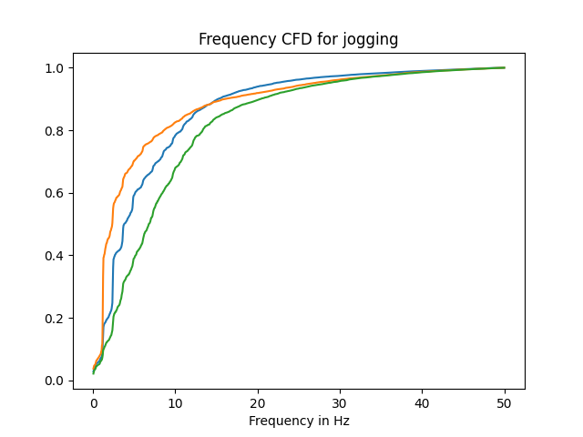  

##### Results Sprinting
Sampling freq: 1 Hz | Sampling freq: 5 Hz | Sampling freq: 10 Hz
--- | --- | ---
 |  | 

Sampling freq: 10 Hz | Sampling freq: 100 Hz
--- | ---
 | 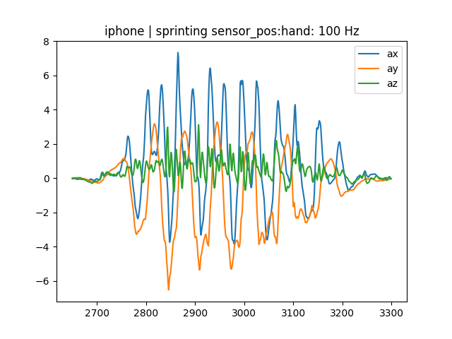

Again it can be seen that a sampling frequency of 1 Hz is insufficient to reconstruct the signal. The reproduced timeseries at 5 Hz also does not seem to have captured all the detail, while the difference between 10 Hz and 100 Hz again is marginal.

Spectrum narrow view | Spectrum wider view
--- | ---
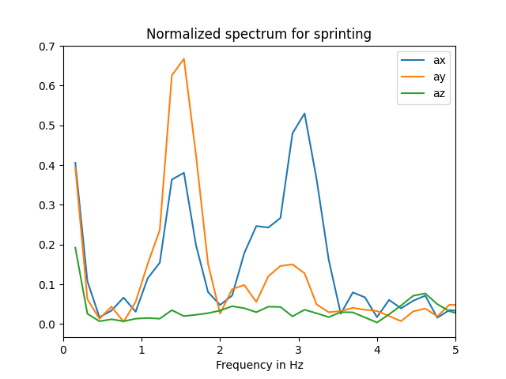 | 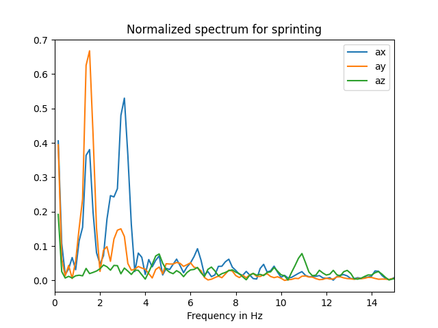

The frequency peaks are around 1.5 Hz and 3 Hz, but there are also some spikes at higher frequencies. According to the CFD more than 80% of the energy is located in the frequencies below 10 Hz (dependent on axis).
  
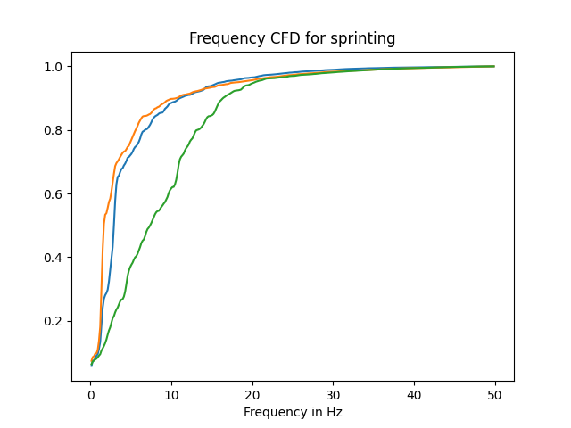

##### Results Squats
Sampling freq: 1 Hz | Sampling freq: 5 Hz | Sampling freq: 10 Hz
--- | --- | ---
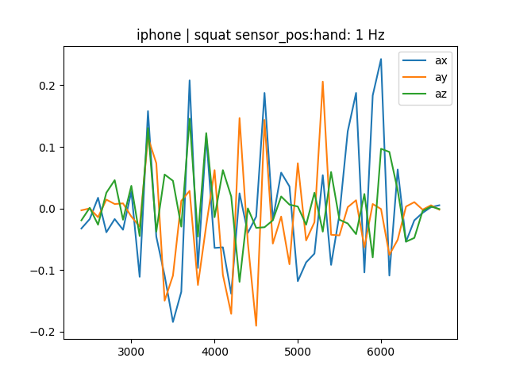 | 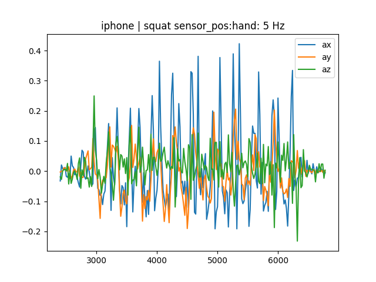 | 

Sampling freq: 10 Hz | Sampling freq: 100 Hz
--- | ---
 | 

While 1 Hz is again too low to capture all information, a sampling rate of 5 Hz is quite sufficient and does not seem to differ significantly from the 10 Hz recordings. 

Spectrum narrow view | Spectrum wider view
--- | ---
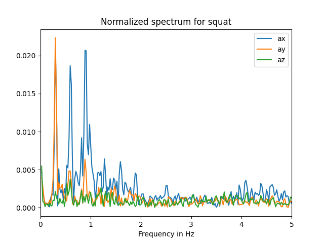 | 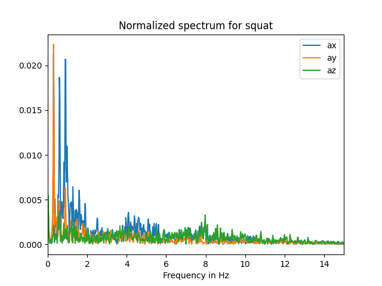

The most significant peaks are all below 1 Hz, making this spectrum look quite different when compared to the activities involving walking and even making a sampling rate of 2 Hz look viable.
  
 

##### Results Summary
The dominant frequencies for the different activities can be found in the following table:

Desc | Walking | Jogging | Sprinting | Squat
------ | ------ | ------ | ------ | ------
Frequency (Hz) | 0.8, 1.8 | 1.1, 2.3 | 1.5, 3 | 0.25, 0.6, 0.8

#### Synchronization
Another factor is the possibility of synchronizing the acceleration sensor timeseries to the recorded video samples. The best case scenario here would be to have frequency of the acceleration sensor match the one of the video, or be a multiple of it, as this allows for better synchronization where the samples of both streams can be closer matched. This will of course not guarantee perfect synchronisation and no drift between the two data streams, but both should at least be quite close when compared to using non-multiple frequencies of one another. The latter sampling rates also come with the additional problem that, even given perfect start synchronisation between video- and acceleration stream and no time drift, they both can only ever record data at the exact same time when the cumulated sum of sampling operations for any of the devices is a common multiple of the two different frequencies.  
As the videos are currently recorded with 30 Hz, we do not have the option for a perfectly matching frequency (or multiples of it). In this case a higher frequency should lead to better synchronisation possibilities due to the higher amount of samples.

#### Memory constraints
In the current iteration of the firmware and gateway software, the expected behaviour is that the acceleration log is written to the memory until it is filled up and then send as a JSON file to the hub device (in our case the Raspberry Pi). This leads to further considerations of memory constraints as memory becomes the limiting factor for the duration of the activity recording. Every doubling in sample rate would lead to a halving in runtime for the accelerometer.  
This does not always seem to work as intended currently, resulting in varying lengths of timeseries even for the same settings, which makes it hard to determine the impact and actual output length of the sensor. After taking multiple measurements and removing outliers, the average duration for a sampling frequency of 100 Hz seems to be around 90s, around 9000 samples, which should be no constraint for recordings of short time activities during the testing stage. Even when going down to 10 Hz, the theoretical duration should be around 900s, or 15 minutes. Further decreasing the frequency down to 1 Hz would scale the duration by another factor of 10, making it possible to record up to 150 minutes and thereby being suitable for long time activities. But due to considerations named in the previous sections 1 Hz is not viable even for walking, and 10 Hz also seems questionable when looking at the spectra of different activities and taking into consideration the synchronization aspect with the video.  
It seems obvious from these observations that, to make the software viable for monitoring longer activities, some kind of streaming mode needs to be implemented which allows for the constant streaming of data from the ruuviTag to a gateway device. This should also lead to a more consistent behaviour, as currently the implementation seems bugged and not to deliver the intended values ([see also here](./current_bugs.md)).

#### Energy consumption
Taking a closer look at the energy consumption on page 10 of the [sensor datasheet](https://www.st.com/resource/en/datasheet/lis2dh12.pdf) shows that increasing the sampling rate to the next higher level will result in roughly doubling of energy consumption for the sensor. The same correlation can be found for switching between 8-bit and 10-bit resolution, impacting the sensitivity of the accelerometer.  
The ruuviTag is run with a CR2477 battery, which according to [Panasonic](https://na.industrial.panasonic.com/products/batteries/rechargeable-batteries/series/90816/model/90849) has a nominal capacity of 1000 mAh. The current at 100 Hz for the 8-bit and 10-bit data output is 10 and 20 \[micro] A, ending up with runtimes of around 100.000h and 50.000h, respectively, according to the following formula:  

\[t = \frac{P}{W} = \frac{A_{battery} \cdot V \cdot h}{A_{accel} \cdot V} = \frac{A_{battery} \cdot h}{A_{accel}}\]

This does of course not take into consideration the other components of the ruuviTag device but shows that the accelerometer power intake seems to be a neglectible factor when compared to the rest of the device.

### Recommendation
This section summarizes the previous findings and tries to give a recommendation for sensor settings.  
It could be seen that the consideration of the Nyquist-theorem in combination with the available sampling frequencies provided by the sensor should not lead to any problems when looking at bigger movements during the kinds of typical activities for a fitness tracker as the frequencies of the base movement cycle are comparably low. Everything above 10 Hz should suffice for most activities, but using higher rates allows for more accurate synchronization with video data. As there is no multiple of the current video frame rate (30 Hz) available, a frequency of at least 50 Hz should be chosen, where more helps to improve synchronization. The only negative impact of higher sampling rates is a lower battery runtime as mentioned in the previous section.  
Taking a closer look at the measurement amplitudes has shown that there are significant differences in the range of accelerations when looking at different activities. The sensor settings for measurement range should therefore vary depending on the activity in order to find the best suitable tradeoff between range and sensitivity. This will avoid maxing out during high acceleration measurements at the cost of less sensitiy for smaller changes in acceleration or vice versa. The sensitivity should never be set to 12-bit as this will drastically reduce the bandwith of the sensor.

## Time Drift

Measurements using RuuviTag *C7:22:C6:A1:0D:DA* have shown that the average time drift over one day is linear, with the RuuviTag time running ahead of the gateway time by 2.7 seconds. The drift increases linearly throughout the day.  

Temperature effects were not considered. It can not be guaranteed that this observation is valid for other tags due to hardware differences.  

More information about the data collection and analysis process can be found in the IPython notebook *analyze_timedrift.ipynb* and the associated elaboration.

## Time Synchronisation 

The function *set_time()* of class *Tag* does not set the RuuviTag time as expected. Mentioned measurements with tag *C7:22:C6:A1:0D:DA* show that even when the time is set, the existing time drift persists. To synchronize video and acceleration data during data labeling, targeted mechanical actions such as three quick strokes can be used to mark acceleration peaks.  

The time drift must be considered in any case. Filming at 30 fps means one frame every 33.3 ms. With a time drift of 2.7 s per day, it can be calculated that the RuuviTag clock drifts by a half frame every 8.9 minutes on average. To ensure that most of the data is correctly associated with the frame, a synchronization should be performed at least after this period of time. A higher synchronization rate increases accuracy. For other applications, a lower synchronization rate may be sufficient. The following formula is used for the calculation and can be adapted to other conditions.

$$
T_{sync} = \frac{0.5 \cdot \frac{1}{f}}{\Delta t_{day}} \cdot T_{day} 
= \frac{0.5 \cdot T_{day}}{\Delta t_{day} \cdot f} 
= \frac{0.5 \cdot 1440~min}{2.7 s \cdot 30 \frac{1}{s}} 
= 8.9~min
$$
